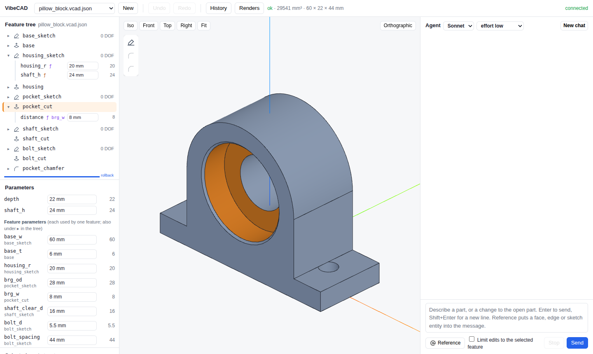
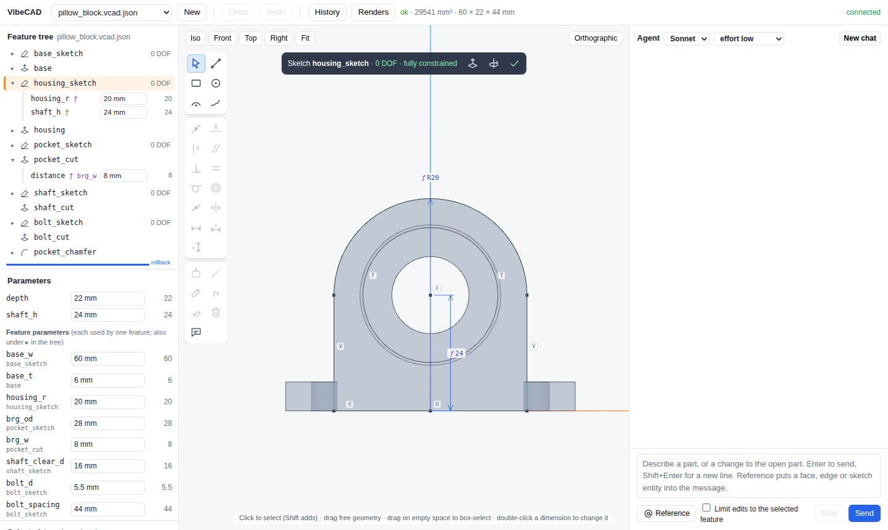
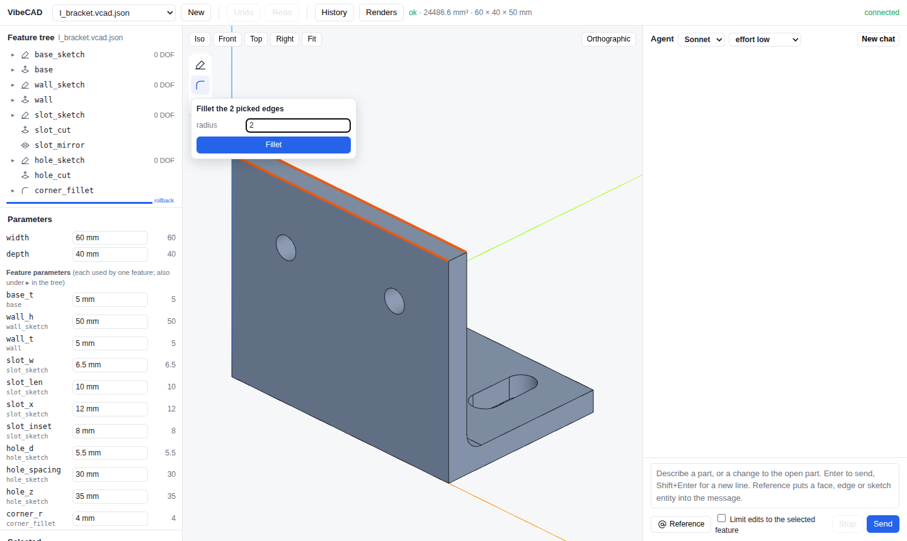
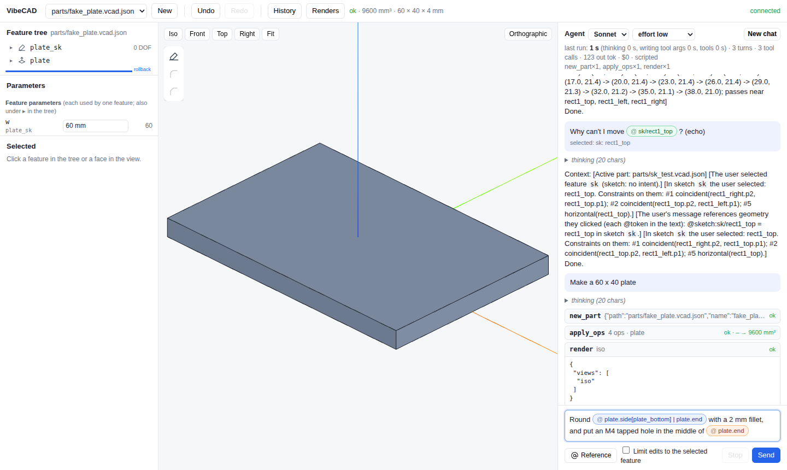

# VibeCAD

AI-assisted parametric CAD. You and the AI edit the same thing: a readable feature tree of named parameters, fully constrained sketches and features (`*.vcad.json`), regenerated into a B-rep solid with OpenCascade. You can talk to the agent, edit by hand, or both in the same session. Either way every change is one undoable step.



Design doc: https://claude.ai/code/artifact/143cbf50-54de-4302-849d-9ac99055b488

## What it looks like

### Feature tree and parameters

The left panel holds the feature tree, which updates live and flashes the features that changed. Click ▸ on a feature to see its own numbers and edit them in place: a sketch's dimensions, an extrude's distance, a fillet's radius. A number driven by a parameter shows `ƒ`. It shows `ƒ name` when it is driven by a parameter with a different name. Orange means the parameter is shared with other features.

The Parameters table lists **global** parameters first: those shared by several features, or not used yet. Below them are **feature parameters**, each used by only one feature, with its owner underneath.

You can also:
- drag the blue rollback bar to see the part at an earlier step
- Rename, Suppress, ↑/↓ or Delete the selected feature
- edit its intent (the one line that says why it exists) or its JSON

### Sketch editor



Click a sketch to edit it on its plane, viewed straight on. The solver (PlaneGCS) runs on the server, and the view updates as you drag.

- **Drawing:** the palette on the left has line, rectangle, circle, arc and a freehand mark tool. The keys are `S L R C A M`.
- **Constraints:** coincident, horizontal/vertical, parallel, perpendicular, equal, tangent, concentric, midpoint and symmetric. Buttons enable only when the selection fits.
- **Dimensions:** drawn the way CAD tools draw them, with extension lines, arrows, `⌀` for diameters and `R` for radii. Double-click one to change its value. `ƒ` marks a dimension driven by a parameter; hover it to see which one.
- **Dragging:** drag free geometry and the solver keeps every constraint. Fully constrained geometry stays put, and the hint tells you which dimension to change instead.
- **Status:** the bar at the top shows the degrees of freedom (DOF) left. Conflicting or redundant constraints turn red and are named.
- **Project:** projects the outline of the face under a face sketch as fixed construction geometry that follows the part when upstream sizes change.
- **Other actions:** rename, → Param (turn a dimension into a named parameter), construction, delete, and Ask agent. Ask agent sends the selected entities and the constraints on them.

### Pick edges and faces, then fillet or chamfer



Click an edge in the 3D view to pick it; shift-click to add more. Clicking a face picks all of its edges, and two faces pick the edge between them. Fillet and Chamfer act on what you picked.

To change an existing fillet or chamfer's edges, select it in the tree and click **Edit edges…**. The view rolls back to just before it, with its current edges highlighted. Click edges to add or remove them, then Done (or Esc to cancel).

A picked edge is saved as a *semantic* reference, never an index: "the edge between `wall.start` and `wall.side[wall_top]`". The server checks that the reference resolves to exactly that edge before using it, so the fillet stays on the right edge when sizes change upstream.

### Talk to the agent, pointing at geometry



Type a request in the right panel. **@ Reference** then a click on a face, an edge or a sketch entity puts it in your message as a chip. The agent receives the exact FaceRef/EdgeRef (or the sketch constraints) behind each chip, so "round this edge" is never ambiguous. Freehand marks drawn in a sketch go along with the next message too. **📎** (or dropping or pasting files into the panel) attaches files: the agent sees images and PDFs directly, and text files (CSV, JSON, STEP, …) inline. Uploads are kept in `uploads/`.

Each part has its own conversation. Opening another part shows that part's conversation, and the agent picks it up where it left off; a part the agent creates keeps the conversation that made it. Conversations are saved next to the part as `<part>.chat.json`.

Edits on a big part take a few seconds. While one is applied, a status pill in the view says what is happening ("Rebuilding stud_grid (12 of 27)… 1.4 s", then "Updating the 3D view"), and the feature being rebuilt is highlighted in the tree.

Every tool call the agent makes appears as it happens, with its result (volume change, errors, warnings) and the renders the agent looks at. Timing, token and cost numbers show when it finishes. Tick "Limit edits to the selected feature" to fence the agent in.

## Run it

```
uv sync                      # Linux/Windows; on macOS ./scripts/setup_mac.sh
uv run vibecad-app           # then open http://127.0.0.1:8765
```

`--root DIR` picks the folder of parts (default: current directory); new parts go in `parts/`. `--model` picks the model (default sonnet). The agent runs through your Claude login (Claude Pro/Max works, no API key needed) and counts against its usage limits.

### Command line

```
uv run vibecad build examples/l_bracket.vcad.json            # STEP, STL, 5 PNG views, sketch PNGs, report.json -> out/l_bracket/
uv run vibecad build examples/l_bracket.vcad.json --set width=80 --show
uv run vibecad tree examples/enclosure_lid.vcad.json         # feature tree with status
```

### Designing parts with Claude Code

Register the MCP server once: `claude mcp add --scope project vibecad -- uv run --quiet vibecad-mcp`. Then ask Claude Code for a part in this folder. `CLAUDE.md` loads the design guide (`agent/GUIDE.md`).

## How it works

| Piece | What |
|---|---|
| Part format | `*.vcad.json`: params (with units and expressions), sketches, features, each with an `intent`. Reference: [docs/IR.md](docs/IR.md) |
| Geometry | build123d on OCP (OpenCascade). Faces are labelled by the feature that made them (`wall.side[wall_top]`), and labels are carried through OCCT's own operation history, so references survive regeneration |
| Sketch solver | PlaneGCS (FreeCAD's solver) via `planegcs`, on the server. The GUI's drag and freedom checks call the same solver |
| Edits | Ops (`set_param`, `add_feature`, `add_rectangle`, `set_dimension`, `rename_feature`, ...) applied in atomic batches. A batch that fails or doesn't validate changes nothing. Undo and redo are shared by you and the agent, and every batch is logged to `*.history.jsonl` |
| Agent | Claude through the Agent SDK, with the tools in `workspace.py`. The GUI, the MCP server and the benchmark share them |
| GUI | FastAPI plus vanilla JS and three.js, with no build step (`core/vibecad/static/`) |

## Status

- **Reference parts:** 10 in `examples/`, including a bracket, pillow block, enclosure lid, NEMA 17 mount, battery tray and strap, and hex standoff. They regenerate with every sketch fully constrained, and their volumes match hand calculations. Every parameter is swept ±10% and must still rebuild.
- **Tests:** `uv run pytest` runs 270 tests.
- **Browser tests:** `scripts/gui_smoke.sh` runs about 190 Playwright checks, covering the main flows, modelling a part by hand from an empty file, the sketch editor, and the agent panel against a scripted agent.

## Measuring the agent

`uv run vibecad-bench --only battery_mount --variant lean` runs design tasks headlessly (`bench/tasks.json`) under setup variants (`bench/variants.json`), checks the resulting parts, and records time to first output, thinking time, tool time, tool calls, rejected batches, tokens and cost. Findings so far: [docs/agent-efficiency.md](docs/agent-efficiency.md). Test plan: [docs/testing-plan.md](docs/testing-plan.md). Runs use your Claude login's usage.

## Screenshots

The images in `docs/img/` are taken from the running app: `ONLY=readme_shots scripts/gui_smoke.sh docs/img`.

## License

MIT
