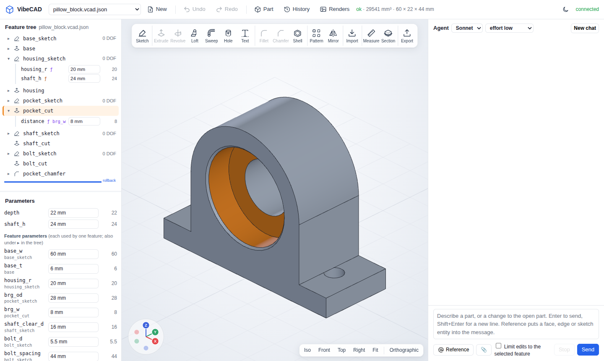
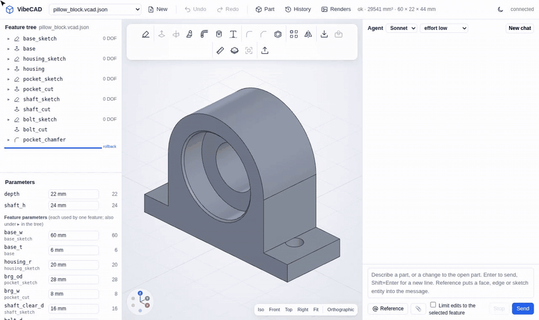
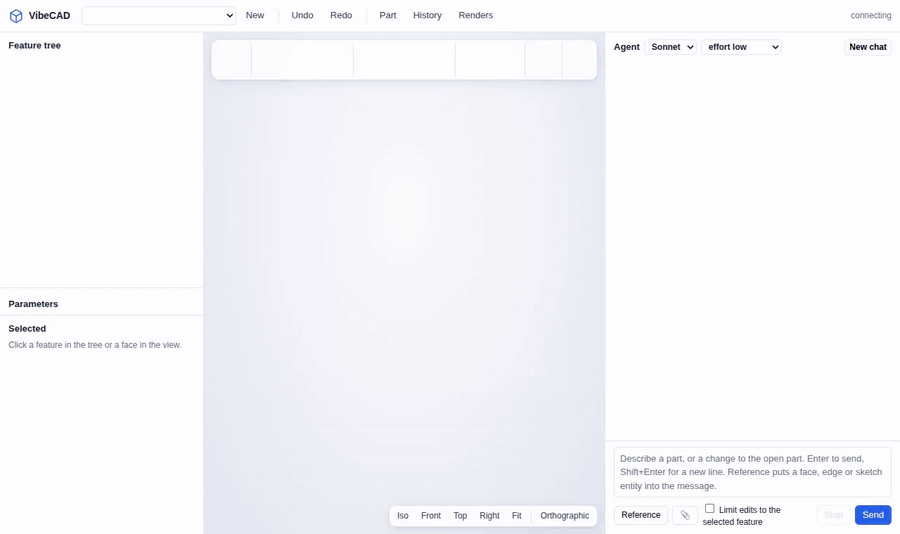
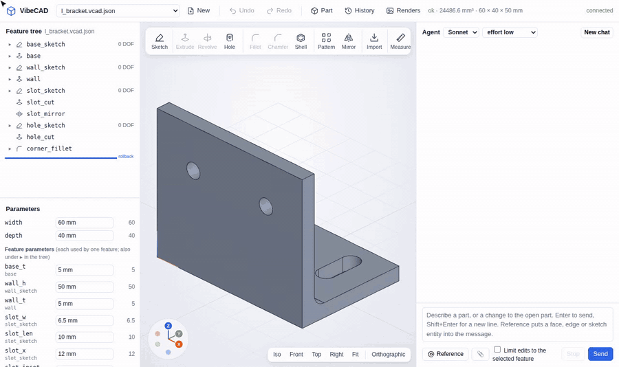
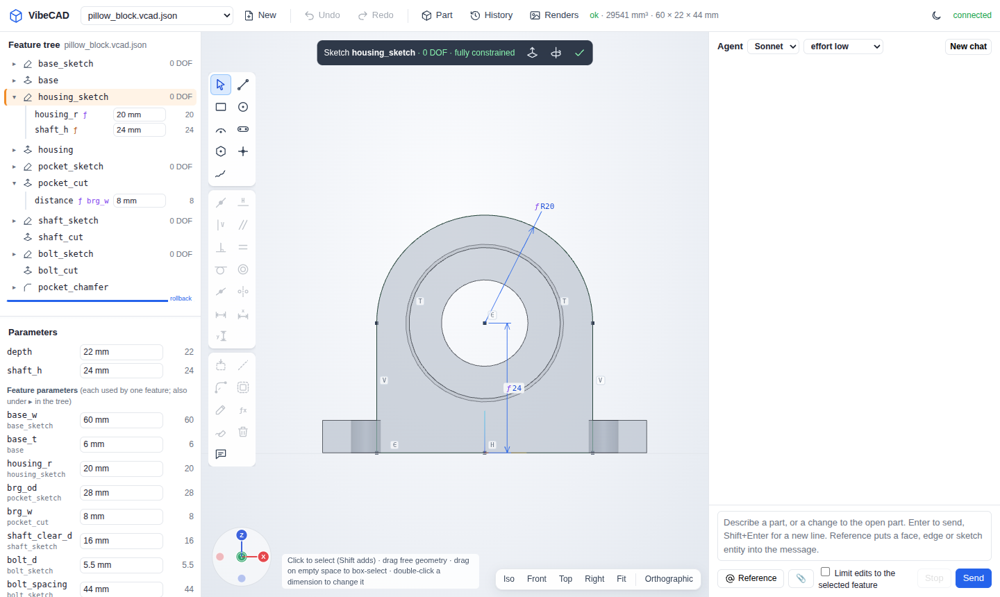
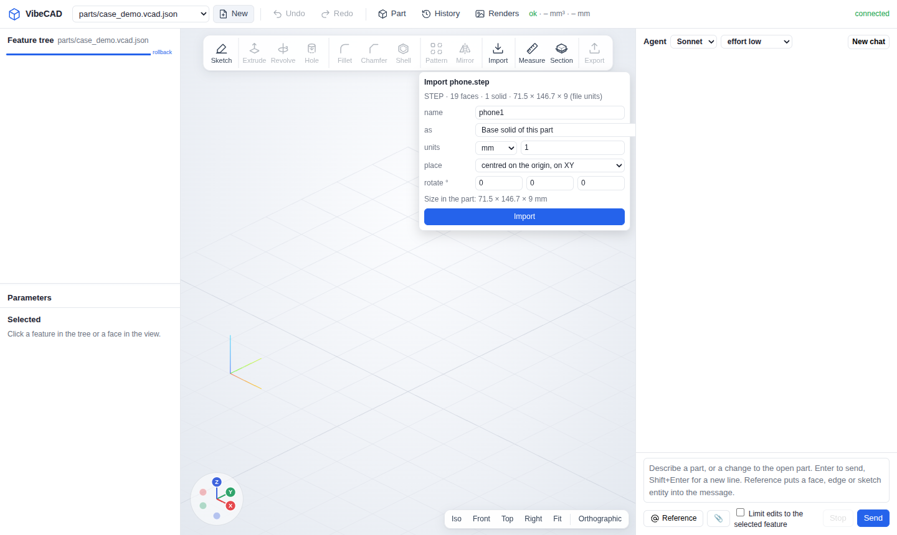
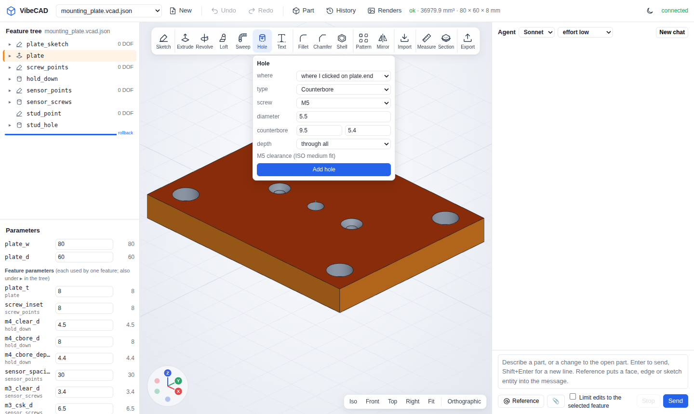
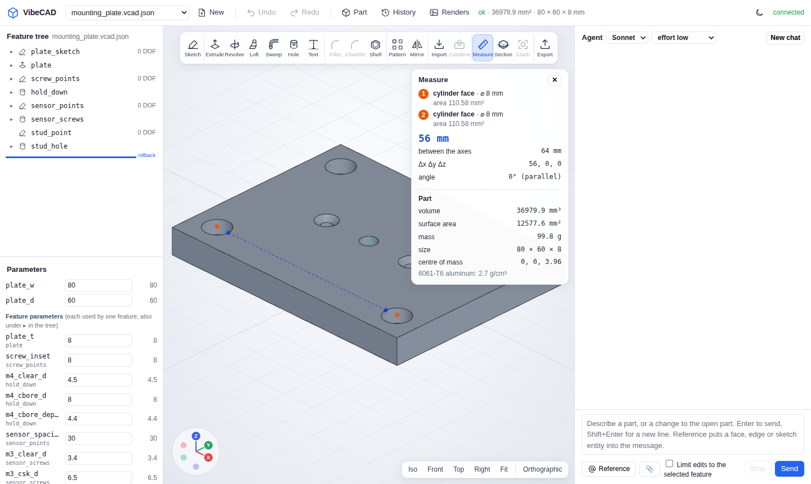
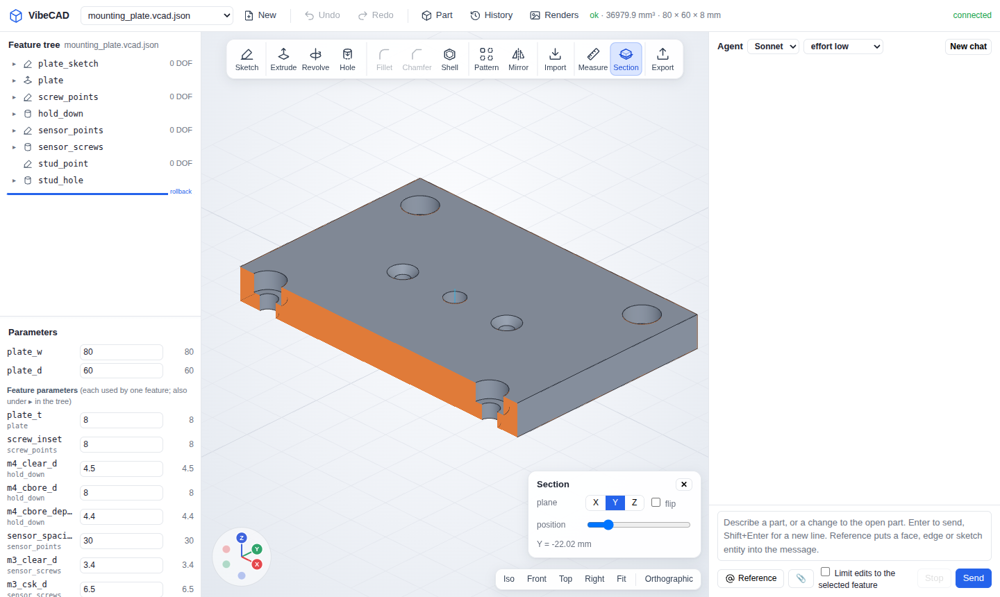

# VibeCAD

AI-assisted parametric CAD. You and the AI edit the same thing: a readable feature tree of named parameters, fully constrained sketches and features (`*.vcad.json`), regenerated into a B-rep solid with OpenCascade. You can talk to the agent, edit by hand, or both in the same session. Either way every change is one undoable step.



Design doc: https://claude.ai/code/artifact/143cbf50-54de-4302-849d-9ac99055b488

| | |
|---|---|
| [Parameters and history](#feature-tree-and-parameters) | [Sketching and modelling by hand](#sketch-editor) |
|  |  |
| [Fillets and edges](#pick-edges-and-faces-then-fillet-or-chamfer) | [The agent](#talk-to-the-agent-pointing-at-geometry) |
|  |  |

## What it looks like

### Feature tree and parameters


The left panel holds the feature tree, which updates live and flashes the features that changed. Click ▸ on a feature to see its own numbers and edit them in place: a sketch's dimensions, an extrude's distance, a fillet's radius. A number driven by a parameter shows `ƒ`. It shows `ƒ name` when it is driven by a parameter with a different name. Orange means the parameter is shared with other features.

The Parameters table lists **global** parameters first: those shared by several features, or not used yet. Below them are **feature parameters**, each used by only one feature, with its owner underneath.

Edits on a big part take a few seconds. While one is applied, a status pill in the view says what is happening ("Rebuilding stud_grid (12 of 27)… 1.4 s", then "Updating the 3D view"), and the feature being rebuilt is highlighted in the tree. The agent's edits show it too.

You can also:
- drag the blue rollback bar to see the part at an earlier step; new features (yours or the agent's) go in at the bar
- Rename, Suppress, ↑/↓ or Delete the selected feature
- **Edit…** it (or double-click it in the tree): the form that made it opens again, filled in (extrude distance and direction, hole type and size, pattern count, import placement, ...)
- edit its intent (the one line that says why it exists) or, under JSON, the raw feature
- set the part's name, material, process and design notes with **Part** in the header; the material gives Measure its mass

The tree scrolls on its own; drag the bar under it to give it more or less room. `?` lists the keyboard shortcuts, and the moon button in the header switches to the dark theme.

### Sketch editor




Click a sketch to edit it on its plane, viewed straight on. The solver (PlaneGCS) runs on the server, and the view updates as you drag.

- **Drawing:** the palette on the left has line, rectangle, circle, arc, slot, polygon, point and a freehand mark tool. The keys are `S L R C A O N P M`. Slots and polygons arrive fully constrained; points mark where holes go.
- **Constraints:** coincident, horizontal/vertical, parallel, perpendicular, equal, tangent, concentric, midpoint and symmetric. Buttons enable only when the selection fits.
- **Dimensions:** drawn the way CAD tools draw them, with extension lines, arrows, `⌀` for diameters and `R` for radii. Double-click one to change its value. `ƒ` marks a dimension driven by a parameter; hover it to see which one.
- **Dragging:** drag free geometry and the solver keeps every constraint. Fully constrained geometry stays put, and the hint tells you which dimension to change instead.
- **Status:** the bar at the top shows the degrees of freedom (DOF) left. Conflicting or redundant constraints turn red and are named.
- **Project:** projects the outline of the face under a face sketch as fixed construction geometry that follows the part when upstream sizes change.
- **Round corner** (`F`): select the point where two lines meet and type a radius. The lines are trimmed and joined by a tangent arc; dimensions to the corner keep measuring to the sharp corner, so a rounded rectangle keeps its size.
- **Offset** (`K`): select an edge; its whole connected outline is copied at a distance (a negative one for inside). The copy follows the original and its distance can be a parameter, so "a 2 mm wall inside this outline" or "a 0.3 mm clearance around the projected phone" stay right when sizes change.
- **Other actions:** rename, → Param (turn a dimension into a named parameter), construction, delete, and Ask agent. Ask agent sends the selected entities and the constraints on them.

**Modelling by hand.** The toolbar across the top of the view has **Sketch** (on XY, XZ or YZ with an offset, or on the face you last clicked), **Extrude**, **Revolve**, **Hole**, **Text**, **Fillet**, **Chamfer**, **Shell**, **Pattern**, **Mirror**, **Import**, **Measure**, **Section** and **Export**. Extrude and Revolve act on the sketch selected in the tree, or else the newest sketch nothing uses yet; they open it with the form (a distance, through all, or up to a face parallel to the sketch, picked from a list; a draft angle for molded or printed parts; direction; add / cut / new / intersect; revolve axis and angle). Inside a sketch the same two buttons sit in the dark bar at the top. The gizmo in the corner shows the axes; click one to look along it.

### Working with real parts



**Import** (or drop a file on the view) brings in STEP, IGES, BREP or STL. The form shows what is in the file and its size once scaled. The units are guessed from the size, and you can type your own scale. You can keep the file's position or centre it on the origin. Choose how it joins the model:
- **Reference:** a mating part to design around (a phone, a motor, a board). It is drawn in violet and is not part of the solid, but you can sketch on its faces, **Project** its edges into a sketch, and measure to it.
- **Base solid, add, cut, intersect:** it becomes part of the model. IGES and STL surfaces are sewn into a solid when they close.

The file is copied next to the part (`imports/`) and re-read when it changes on disk.

For a phone case, import the phone as a solid, click its screen, and **Shell** it outward by the wall thickness: the case skin, open where the screen is.



**Hole:** click a flat face where the hole goes, then choose the type and an ISO screw size (M2–M12). The size presets fill in the numbers:

| Type | What the preset fills in |
|---|---|
| Simple | the clearance diameter |
| Counterbore | a counterbore for a socket-head screw |
| Countersink | a 90° countersink for a flat-head screw |
| Tapped | a blind hole at the tap drill size, recorded with its thread (`M4x0.7`) |

This adds a small sketch holding the dimensioned position, and the hole. To drill several at once, put points in a sketch (Point tool) and choose "at every point of" that sketch. Holes can be patterned and mirrored like extrudes.



**Measure** (`M`): click faces or edges. One pick gives its type and size (diameter, area, length). Two picks give:
- the distance between them, plus the distance between two planes or two axes
- the angle between them
- the part's volume, surface area, mass (from its material), size and centre of mass



**Text:** click a face, type the text (a part number, a revision, an arrow), and choose engraved or embossed, with height, depth and angle. Like a hole, it gets a dimensioned position sketch.

**Section** cuts the view with a plane along X, Y or Z. It keeps the half away from you, so the cut faces you, and the inside shows in orange. **Export** downloads the part as STEP, STL, 3MF, BREP or glTF, or as a **drawing**: an SVG sheet (A4 or A3, at a standard scale so it prints true to size) with front, top and right views in third-angle projection, hidden lines, an isometric, overall dimensions, a callout for every hole feature (`4× ⌀4.5 THRU, CBORE ⌀8 ↧4.4`) and a title block with material and process.

### Pick edges and faces, then fillet or chamfer


Click an edge in the 3D view to pick it; shift-click to add more. Clicking a face picks all of its edges, and two faces pick the edge between them. Fillet and Chamfer act on what you picked.

To change an existing fillet or chamfer's edges, double-click it in the tree (or select it and click **Edit edges…**). The view rolls back to just before it, with its current edges highlighted. Click edges to add or remove them, then Done (or Esc to cancel).

A picked edge is saved as a *semantic* reference, never an index: "the edge between `wall.start` and `wall.side[wall_top]`". The server checks that the reference resolves to exactly that edge before using it, so the fillet stays on the right edge when sizes change upstream.

### Talk to the agent, pointing at geometry


*The recording uses the scripted stand-in agent from the browser tests (`tests/gui/fake_agent_app.py`), so it is quick and free to re-record; a real model's run looks the same, only slower.*

Type a request in the right panel. **@ Reference** then a click on a face, an edge or a sketch entity puts it in your message as a chip. The agent receives the exact FaceRef/EdgeRef (or the sketch constraints) behind each chip, so "round this edge" is never ambiguous. Freehand marks drawn in a sketch go along with the next message too. **📎** (or dropping or pasting files into the panel) attaches files: the agent sees images and PDFs directly, and text files (CSV, JSON, STEP, …) inline. Uploads are kept in `uploads/`.

**Model and effort** can be switched at any time from the panel header; the conversation continues. Effort defaults to low, which measured about 3x faster than the default with the same pass rate on the benchmark.

Each part has its own conversation. Opening another part shows that part's conversation, and the agent picks it up where it left off; a part the agent creates keeps the conversation that made it. Conversations are saved next to the part as `<part>.chat.json`.


Every tool call the agent makes appears as it happens, with its result (volume change, errors, warnings) and the renders the agent looks at. Timing, token and cost numbers show when it finishes. Tick "Limit edits to the selected feature" to fence the agent in.

## Run it

```
uv sync                      # Linux/Windows; on macOS ./scripts/setup_mac.sh
uv run vibecad-app           # then open http://127.0.0.1:8765
```

`--root DIR` picks the folder of parts (default: current directory); new parts go in `parts/`. `--model` picks the model (default sonnet). The agent runs through your Claude login (Claude Pro/Max works, no API key needed) and counts against its usage limits.

### Command line

```
uv run vibecad build examples/l_bracket.vcad.json            # STEP, STL, 5 PNG views, sketch PNGs, report.json -> out/l_bracket/
uv run vibecad build examples/l_bracket.vcad.json --set width=80 --show
uv run vibecad tree examples/enclosure_lid.vcad.json         # feature tree with status
```

### Designing parts with Claude Code

Register the MCP server once: `claude mcp add --scope project vibecad -- uv run --quiet vibecad-mcp`. Then ask Claude Code for a part in this folder. `CLAUDE.md` loads the design guide (`agent/GUIDE.md`).

## How it works

| Piece | What |
|---|---|
| Part format | `*.vcad.json`: params (with units and expressions), sketches, and features (extrude, revolve, hole, fillet, chamfer, shell, patterns, mirror, import), each with an `intent`. Reference: [docs/IR.md](docs/IR.md) |
| Geometry | build123d on OCP (OpenCascade). Faces are labelled by the feature that made them (`wall.side[wall_top]`), and labels are carried through OCCT's own operation history, so references survive regeneration |
| Sketch solver | PlaneGCS (FreeCAD's solver) via `planegcs`, on the server. The GUI's drag and freedom checks call the same solver |
| Edits | Ops (`set_param`, `add_feature`, `add_rectangle`, `set_dimension`, `rename_feature`, ...) applied in atomic batches. A batch that fails or doesn't validate changes nothing. Undo and redo are shared by you and the agent, and every batch is logged to `*.history.jsonl` |
| Agent | Claude through the Agent SDK, with the tools in `workspace.py`. The GUI, the MCP server and the benchmark share them |
| GUI | FastAPI plus vanilla JS and three.js, with no build step (`core/vibecad/static/`) |

## Status

- **Reference parts:** 11 in `examples/`, including a bracket, pillow block, enclosure lid, NEMA 17 mount, battery tray and strap, hex standoff, and a mounting plate with counterbored, countersunk and tapped holes. They regenerate with every sketch fully constrained, and their volumes match hand calculations. Every parameter is swept ±10% and must still rebuild.
- **Tests:** `uv run pytest` runs 332 tests. They include imports of STEP, IGES, BREP and STL (exact round trips, units, placement, sewing surfaces), and every hole type against its volume formula.
- **Browser tests:** `scripts/gui_smoke.sh` runs about 280 Playwright checks. They cover:
  - the main flows
  - modelling a part by hand from an empty file
  - the sketch editor
  - the agent panel, against a scripted agent
  - editing a fillet's edges, per-part conversations, attachments and the rebuild indicator
  - real-part work: imports, holes, pattern, mirror, shell (including the phone case), measure, section, export and editing features

  With `USERPARTS=folder` it also opens your own parts, changes a parameter of each and undoes it.

## Measuring the agent

`uv run vibecad-bench --only battery_mount --variant lean` runs design tasks headlessly (`bench/tasks.json`) under setup variants (`bench/variants.json`), checks the resulting parts, and records time to first output, thinking time, tool time, tool calls, rejected batches, tokens and cost. Findings so far: [docs/agent-efficiency.md](docs/agent-efficiency.md). Test plan: [docs/testing-plan.md](docs/testing-plan.md). Runs use your Claude login's usage.

## Screenshots and GIFs

The images in `docs/img/` are taken from the running app: `ONLY=readme_shots scripts/gui_smoke.sh docs/img` for the PNGs, `ONLY=readme_gifs scripts/gui_smoke.sh docs/img` for the GIFs (Playwright video, a drawn cursor and captions, converted with ffmpeg; `GIFS=edges` records one. No ffmpeg? `uv run --no-project --with imageio-ffmpeg python -c "import imageio_ffmpeg; print(imageio_ffmpeg.get_ffmpeg_exe())"` prints the path of a static build to put on your PATH).

## License

MIT
